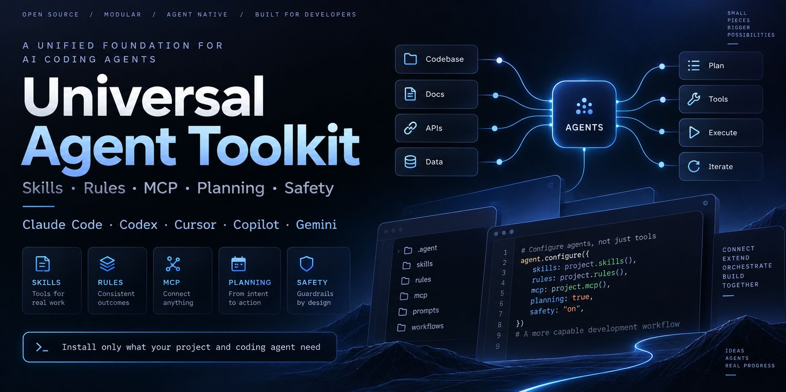

# Universal Agent Toolkit

Install AI coding rules, skills, MCP servers, safety guardrails and a project
planning workflow into any project — **for the coding agent you actually use,
and nothing else.**

```bash
./bin/uat install --project ~/code/my-app --agent claude-code
```

That creates exactly one folder, `.agent-toolkit/`, plus the two or three
files Claude Code itself needs. It does not create `.cursor/`, `.windsurf/`,
`.clinerules`, `GEMINI.md` or anything else you did not ask for.

**[Getting started](docs/GETTING-STARTED.md) · [CLI reference](docs/CLI.md) ·
[Agent support](docs/AGENT-SUPPORT.md) · [All documentation](docs/README.md)**

---

## Documentation

| Page | What it answers |
|---|---|
| **[Getting started](docs/GETTING-STARTED.md)** | Install it into your first project, in fifteen minutes |
| [CLI reference](docs/CLI.md) | Every command and flag |
| [Agent support](docs/AGENT-SUPPORT.md) | Is my tool supported, and what does it get? |
| [Packs & profiles](docs/PACKS.md) | What can be installed, and how it is chosen |
| [Planning workflow](docs/WORKFLOW.md) | How a project goes from idea to accepted code |
| [Core policy](docs/CORE-POLICY.md) | Safety, git, verification and interaction modes |
| [Vendoring & provenance](docs/VENDORING.md) | Where the content comes from, and how it is trusted |
| [Deployment](docs/DEPLOYMENT.md) | Provisioning and shipping to Ubuntu |
| [Troubleshooting](docs/TROUBLESHOOTING.md) | The agent is ignoring the rules. Now what? |
| [Architecture](docs/ARCHITECTURE.md) | Why it is built this way |

## What it is

A portable toolkit that configures **other** projects for AI coding agents.
It is not an application and it is not a framework — it installs into your
repository and gets out of the way.

It can install and configure:

- engineering-discipline **skills** (brainstorming, TDD, systematic debugging,
  verification, code review)
- stack **rules** and best practices — 41 curated packs, plus ~410 more
  vendored rule documents reachable on demand
- **MCP servers** — Playwright, Context7, GitHub, Figma
- a 14-phase project **planning workflow** with a human approval gate
- **safety guardrails** for databases, Docker volumes and deployment
- **git** discipline: atomic commits, conventional messages, no AI attribution
- **UI/UX and design** workflows, including Figma design-to-code
- **browser verification** so the agent sees what it built
- **deployment** scripts for clean and shared Ubuntu servers

Everything is stored locally in the target repository, and only what that
project needs is activated.

## Why

Every coding agent has its own instruction file, rules directory and MCP
configuration. Claude Code has `CLAUDE.md` and skills. Cursor has
`.cursor/rules/`. Copilot has repository instructions. Gemini CLI has its own
context file. MCP configuration differs again between all of them.

Supporting several tools by hand leaves a project root like this:

```
.cursor/  .windsurf/  .clinerules  .roo/  .claude/  .github/
GEMINI.md  AGENTS.md  CONVENTIONS.md  ...
```

Most of it ends up duplicated, inconsistent, and out of date.

This repository separates two jobs:

1. **A broad library, maintained once** — pinned upstream rules, skills and
   MCP definitions, verified against their source commits.
2. **A narrow install, per project** — detect the stack, install only what
   that project needs, generate only the surfaces that one agent reads.

## Where this repository lives

**Not inside your project.** This repo is the *factory* — `bin/ src/ catalog/
vendor/` are build material, not something you copy into an app. Keep one
copy anywhere:

```bash
git clone <this repo> ~/tools/universal-agent-toolkit
~/tools/universal-agent-toolkit/bin/uat install --project ~/code/my-app --agent claude-code
```

Use it to bootstrap as many projects as you like:

```bash
./bin/uat install --project ~/code/project-a --agent claude-code
./bin/uat install --project ~/code/project-b --agent codex
./bin/uat install --project ~/code/project-c --agent cursor
```

Each project gets its own self-contained agent configuration. The toolkit
stays the reusable source library.

### If you want the project fully self-contained

Add `--embed`. The toolkit copies *itself* inside the folder it already owns,
so the project can manage its own configuration with no external checkout:

```bash
uat install --project ~/code/my-app --agent claude-code --embed
cd ~/code/my-app
.agent-toolkit/toolkit/uat install --project . --agent claude-code --add go
```

| Mode | Adds | Adding a pack later |
|---|---|---|
| default (external) | 0 | needs the toolkit checkout |
| `--embed` | ~900 KB | needs network (`uat vendor sync`) |
| `--embed --with-vendor` | ~10 MB | works fully offline, forever |

Embedding never adds a top-level folder — it goes inside `.agent-toolkit/`.
You can also embed later, into an already-configured project:
`uat embed --project ~/code/my-app --with-vendor`.

## Quick start

```bash
./bin/uat agents                    # 14 supported agents and what each one gets
./bin/uat catalog                   # 60 packs and 6 profiles
./bin/uat detect  --project ~/app   # what stack is in there, and the evidence
./bin/uat install --project ~/app --agent claude-code
```

Add `--dry-run` to see every file that would change before anything does.

```bash
./bin/uat install --project ~/app --agent cursor --profile nextjs
./bin/uat install --project ~/app --agent claude-code --agent cursor
./bin/uat install --project ~/app --agent claude-code --add go   # extends; keeps the rest
./bin/uat install --project ~/app --agent cursor --profile core --replace   # starts over
./bin/uat workflow  --project ~/app     # planning progress and next step
./bin/uat status    --project ~/app     # what is installed, and local drift
./bin/uat uninstall --project ~/app     # removes only what it created
```

Full detail: **[CLI reference](docs/CLI.md)**.

### Interactive by default

On a terminal, `uat install` asks for an interaction mode, then shows a
toggle list of packs with the detected stack pre-checked and the evidence
shown:

```
Select packs to install
  toggle: numbers/ranges (1 3 5-8)   a=all  n=none  r=reset  Enter=accept

  CORE
     1 [x] Karpathy guidelines                 always
     2 [x] Security & OWASP                    always
     3 [x] Superpowers engineering skills      always
  RECOMMENDED
     4 [x] Accessibility (a11y)
     5 [ ] Ubuntu deployment
     6 [x] Docker & containers                 detected: docker
  ...
```

`--yes` skips both prompts. `--packs`, `--profile` and `--all` skip the list,
because you already said what you want.

## What a project gets

```
my-app/
├── .agent-toolkit/          <- everything lives here
│   ├── CORE.md              routing file: what exists, when to read it
│   ├── START-HERE.md        the workflow prompt, for agents without slash commands
│   ├── core/                safety, git, verification, interaction modes
│   ├── workflow/            the 14-phase planning workflow
│   ├── rules/               only the stack rules this project uses
│   ├── skills/              vendored skills, stored once
│   ├── mcp/                 neutral server specs + setup status
│   ├── deploy/  docker/     provisioning and local-dev templates
│   ├── reports/             one report per completed phase
│   ├── project.json         mode, agents, detected stack
│   ├── installed.json       lockfile with content hashes
│   └── toolkit/             the toolkit itself (only with --embed)
├── CLAUDE.md                <- a pointer, ~600 bytes
├── .claude/skills -> ../.agent-toolkit/skills
└── .mcp.json
```

`mcp/`, `deploy/`, `docker/` and `hooks/` appear only when a pack that ships
them is selected. Skills are **symlinked**, not copied, so nothing is
duplicated on disk — use `--copy` on filesystems without symlink support.

## Making the rules stick

Four layers, weakest to strongest. Installing gives you all four.

**1. Passive — the agent reads it on its own.** `CLAUDE.md` (or `AGENTS.md`,
`.cursor/rules/`) is auto-loaded and points at `.agent-toolkit/CORE.md`, which
routes to the workflow, the safety rules and the stack rules. This works, but
relies on the agent choosing to follow a pointer.

**2. Active — you trigger it.** With Claude Code: `/plan`, `/plan-status`,
`/plan-resume`. With any other agent, paste the prompt from
`.agent-toolkit/START-HERE.md`.

**3. Enforced — the `session-reminder` hook.** Included in every profile. It
registers a `SessionStart` hook that injects the non-negotiables into context
at the start of *every* session: run triage first, no implementation before
the gate, read `SAFETY.md` before touching data, verify before claiming done.

This is the layer that makes the difference between rules being *available*
and rules being *used* — the same mechanism Superpowers itself uses. Your
tool will ask you to approve the hook the first time; that prompt is
expected.

```bash
uat install --project . --agent claude-code --add session-reminder
```

**4. Verifiable — you can check.** `uat workflow --project .` shows which
phases have reports and what comes next. Progress lives in
`.agent-toolkit/reports/`, so it survives across sessions, agents and
machines.

If the agent ignores it anyway, work through
**[Troubleshooting](docs/TROUBLESHOOTING.md#the-agent-ignores-the-rules)**.

## Supported agents

Claude Code, Cursor, Codex, GitHub Copilot / VS Code, Gemini CLI, Windsurf,
Cline, Roo Code, JetBrains Junie, OpenCode, Aider, Amp, Zed, Kilo Code.

Every tool-specific path and config key lives in
[`catalog/agents.json`](catalog/agents.json). A format change is a one-line
edit there, never a code change. Each agent carries a `confidence` rating for
how well its format is verified — check it with `uat agents --show cursor`.

Claude Code (`.claude/skills/`) and Codex (`.agents/skills/`) have native
skill discovery, so both get a skills mount. Every other agent gets the same
content as plain Markdown it can read.

An install into a configured project **extends** it: previous packs, agents
and interaction mode are kept, so `--add go` mid-project does not quietly
discard your Cursor config. Use `--replace` to start over deliberately.

Full matrix: **[Agent support](docs/AGENT-SUPPORT.md)**.

## The planning workflow

`.agent-toolkit/workflow/` holds a fourteen-phase sequence any agent can
follow:

| # | Phase | Skill it delegates to |
|---|---|---|
| 00–01 | triage, discovery | — |
| 02 | business logic | `brainstorming` |
| 03 | screens & flows | — |
| 04–05 | stack, rules | — |
| 06 | architecture | `brainstorming` |
| 07–08 | content, design | `writing-guidelines`, `ui-ux-pro-max`, Figma MCP |
| 09 | environments | — |
| 10 | plan | **`writing-plans`** |
| 11 | **gate** | — |
| 12 | execute | **`subagent-driven-development`** |
| 13 | **acceptance** | Playwright MCP |

Triage picks the depth: a one-line fix runs discovery and stops; a new
product runs everything.

**Two bookends never scale away.** Phase 11: nothing is implemented until a
human approves. Phase 13: nothing is called finished until every journey
defined in phase 03 has been performed against a running system. "All tests
pass" is not acceptance — the tests were written by the agent that wrote the
code, and they cover tasks rather than journeys. Anything not exercised is
reported as NOT VERIFIED rather than assumed.

**Design runs after architecture, deliberately.** Screens & flows (03) give
architecture what it needs early; visual design (08) then works against a
chosen component library and a data model that can actually serve the
screens, instead of being redone when they arrive.

**The workflow sequences Superpowers rather than competing with it.** Phase
10 does not define a plan format — it hands over to `writing-plans`, so there
is one plan, in one place, that the execution skills can find. Phase 12 hands
over to `subagent-driven-development`. Four skill instructions are superseded
inside the workflow; the complete list is the "Precedence" section of
`workflow/README.md`, and tests assert it covers every known conflict. **No
vendored file is edited to achieve this.**

How you start it, and what each phase produces:
**[Planning workflow](docs/WORKFLOW.md)**.

## Safety guardrails

An agent should not destroy persistent data because a command was
convenient. `catalog/core/SAFETY.md` installs into every project and gates:

```
docker compose down -v      docker volume rm / prune
migrate:fresh   db:wipe     rails db:drop   django flush
DROP DATABASE   DROP SCHEMA   TRUNCATE
```

> **Production-like data is sacred.** Treat every persistent database,
> volume, uploaded file store and server configuration as valuable unless you
> have positive evidence that it is disposable. Never infer that "local"
> means "safe to wipe".

Before any significant change to production-like data, the backup gate
applies: identify the environment, check backup freshness, take a new backup,
record where it is, define the restore procedure, *then* change something.

No interaction mode bypasses this — autonomous mode still stops at every
data-safety, deployment, credential and deletion gate.

**[Core policy →](docs/CORE-POLICY.md#safety)**

## Git discipline

Agents are instructed to commit by logical change, keep commits reviewable,
use Conventional Commits, and never add AI attribution:

```
feat(auth): add password reset flow
test(auth): cover expired reset tokens
fix(api): return 422 for invalid enrollment state
```

No `Co-authored-by:`, no `Generated-by:`, no model names in commit metadata,
no giant "misc changes" commits — unless you explicitly ask for them.

**[Core policy →](docs/CORE-POLICY.md#git)**

## Browser verification

Playwright is treated as a first-class development capability, not a testing
afterthought. With the `mcp-playwright` pack the agent can drive a real
browser to verify rendered UI, forms, navigation, console errors, user flows
and accessibility behaviour.

> A screenshot proves a page rendered. It proves nothing about whether the
> thing the page is *for* actually happens.

So: drive the flow rather than photograph it, observe the effect through a
different path than the one that caused it, test the denial and not only the
permission, and exercise the unhappy path at least once.

**[Core policy → Verification](docs/CORE-POLICY.md#verification)**

## UI/UX and design

Frontend projects can opt into `ui-ux-pro-max` (style catalogues, colour
palettes, font pairings), `design-system`, `web-design-guidelines`,
`accessibility`, `react-best-practices`, `mcp-figma` for design-to-code, and
`mcp-playwright` for visual verification. The `design` profile bundles
thirteen of them.

```bash
uat install --project ~/app --agent claude-code --profile design
```

Backend-only projects carry none of it. That is the point.

## Provenance is enforced, not claimed

Every vendored file is fetched from a pinned commit and hashed:

```bash
./bin/uat vendor list      # pins, licences and verification state
./bin/uat vendor verify    # re-hashes; a hand-edited snapshot fails loudly
./bin/uat vendor sync      # fetch at the pinned commits
```

| Upstream | Licence | What |
|---|---|---|
| [obra/superpowers](https://github.com/obra/superpowers) | MIT | 14 engineering-discipline skills |
| [github/awesome-copilot](https://github.com/github/awesome-copilot) | MIT | 193 technology instruction guides |
| [PatrickJS/awesome-cursorrules](https://github.com/PatrickJS/awesome-cursorrules) | CC0-1.0 | 257 community rules (gap filling) |
| [vercel-labs/agent-skills](https://github.com/vercel-labs/agent-skills) | MIT | React / Next.js, composition, web design, writing |
| [vercel-labs/web-interface-guidelines](https://github.com/vercel-labs/web-interface-guidelines) | MIT | Interface quality checklist |
| [nextlevelbuilder/ui-ux-pro-max-skill](https://github.com/nextlevelbuilder/ui-ux-pro-max-skill) | MIT | Design intelligence and palettes |
| [emavv/karpathy-guidelines](https://github.com/emavv/karpathy-guidelines) | MIT | Anti-overcomplication guardrails |

Vendored content is **never edited**. Our own policy lives in `catalog/core/`
and `catalog/packs/`. You can also vendor your own content — a house style
guide, a company's internal rules — with
`uat vendor add-local`, and it gets the same hashing and verification.

**[Vendoring & provenance →](docs/VENDORING.md)**

### One store, many pointers

`vendor/` and `catalog/packs/` are not two copies of the same thing:

```
vendor/          9.4 MB   the actual content, fetched from pinned commits
catalog/packs/    328 KB   60 packs - mostly small JSON pointers into vendor/
```

A pack says *which* vendored file to install, what to call it, and when it
applies — so content lives exactly once and adding a pack costs ~400 bytes:

```jsonc
{ "id": "go", "detect": ["go"],
  "vendor_maps": [{ "vendor": "awesome-copilot",
    "files": [{ "from": "instructions/go.instructions.md", "to": "rules/GO.md" }] }] }
```

The two rule libraries hold ~450 documents; about 40 have curated packs. The
long tail is reachable directly rather than through 450 pack files:

```bash
uat catalog --search wordpress
uat add-rule awesome-copilot:wordpress --project .
```

**[Packs & profiles →](docs/PACKS.md)**

## Deployment

The `deploy-ubuntu` pack ships working, tested bash:

- `inspect-server.sh` — read-only audit; run it before touching any server
- `provision-clean.sh` — fresh Ubuntu to ready-to-host
- `provision-existing.sh` — adds an app to a server already running things:
  refuses a taken port, writes exactly one new nginx site, never modifies an
  existing config, validates before reloading, never touches a database
- `deploy.sh` — atomic symlink release with health check and auto-revert
- `rollback.sh` — return to a previous release

Verified by running them on Ubuntu 24.04, including `nginx -t` on the
generated config.

**[Deployment →](docs/DEPLOYMENT.md)**

## Design rules

- **One folder.** Everything installed lives in `.agent-toolkit/`.
- **Only what is asked for.** Selecting one agent never creates another's files.
- **Pointers, not copies.** Tool files route to the canonical content.
- **No silent overwrite.** Existing files are kept and reported; `--force` is explicit.
- **Nothing global.** No global installs, ever.
- **Data is valuable.** Destructive operations are gated, including locally.
- **Evidence before claims.** See [`catalog/core/VERIFICATION.md`](catalog/core/VERIFICATION.md).

## Requirements

Python 3.9+ and git. No dependencies, no install step, no build.

## Tests

```bash
./bin/uat-test     # 151 tests
./bin/uat doctor   # verify catalog, registry and vendored snapshots
```

## Adding things

- **A new agent** — add an entry to [`catalog/agents.json`](catalog/agents.json).
  See [Agent support](docs/AGENT-SUPPORT.md#adding-an-agent).
- **A new rule pack** — add `catalog/packs/<id>/pack.json`; map a vendored
  file or add your own under `files/`. See
  [Packs & profiles](docs/PACKS.md#writing-a-pack).
- **A new upstream** — add it to `catalog/vendor.json` and run
  `uat vendor sync`. See [Vendoring](docs/VENDORING.md#updating-an-upstream).

Working on this repository itself: read [`AGENTS.md`](AGENTS.md) and
[`docs/ARCHITECTURE.md`](docs/ARCHITECTURE.md) first.

## License

The Universal Agent Toolkit's original code and content — everything under
`bin/`, `src/`, `catalog/`, `docs/` and `tests/` — is licensed under the MIT
License. See [`LICENSE`](LICENSE).

Third-party skills, rules, MCP definitions and vendored resources remain
subject to their respective upstream licences. See
[`THIRD_PARTY_NOTICES.md`](THIRD_PARTY_NOTICES.md) and the licence files
included with each vendored snapshot at `vendor/<id>/LICENSE`.
